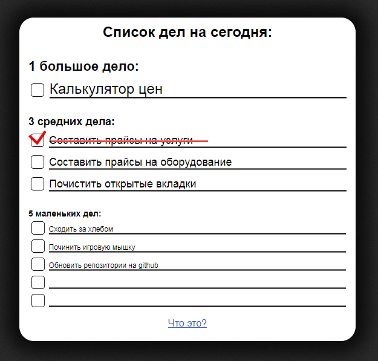

# Simple 1-3-5 to-do web list

* Very simple To-do list for 1-3-5 methodology
* [Check demo here](https://lgg.su/135/)

## ToDo

* *parse CTRL+V and if /newline/ exists paste as next task*
* add adaptive for mobiles
* add usage of Local Storage
* add 1-3-5 version with auth/DB connection/Telegram notes integration

## License

* This was written in 2014, modified in 2017
* MIT
